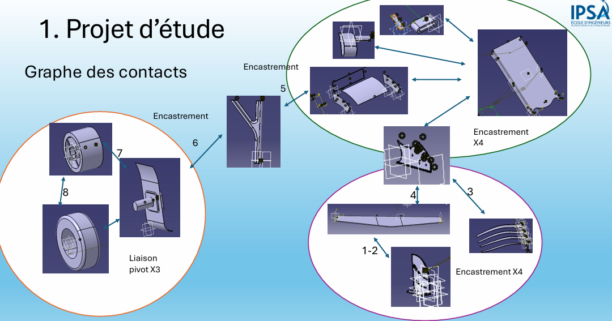
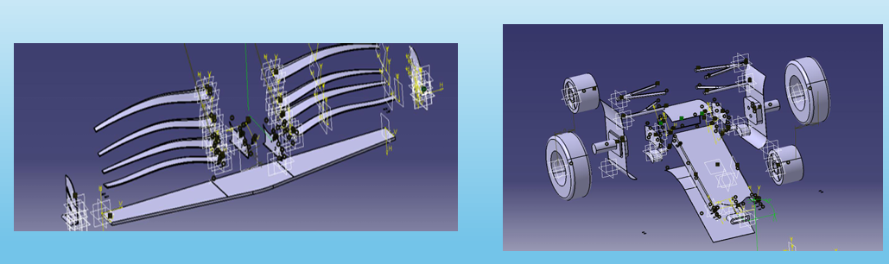
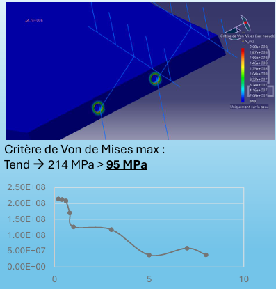
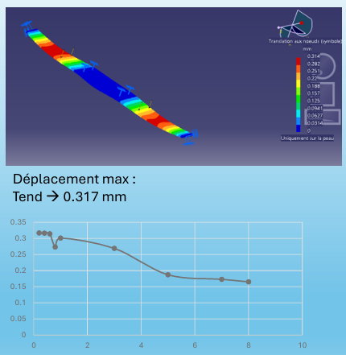

# Train Avant de F1 — CATIA CAD Group Project

Full CATIA V5 modeling and assembly of a Formula 1 front-end assembly (front wing, front suspension, wheel/hub/rim), including a mechanical stress analysis of the front wing under aerodynamic load.

**Team A05 (Mé323):** Yanis Boutabia, Louis Depont, Nathan Mengue-Ateba

## Project scope

A 38-part CATIA assembly covering the full front end of an F1 car:
- **Front wing** — base plane, end plates, lateral appendages, flow deflectors, sensors
- **Front suspension** — 4 suspension arms, suspension mounts
- **Wheel assembly** — hub, wheel, rim, rim cover, front wheel deflectors

Parts were built using both **Part Design** (solid modeling) and **Generative Shape Design / GSD** (surface modeling), depending on part complexity — GSD for the wing's aerodynamic surfaces and flaps, Part Design for the more mechanical/solid components (suspension, hub, wheel).

## Task split

| Member | Scope | Parts |
|---|---|---|
| **Yanis** | Front wing base plane, end plates, lateral appendages, flow deflectors, sensors | ~12 parts (Part Design + GSD), plus assembly |
| **Louis** | Wing flaps (8), assembly | 12 parts (GSD), assembly |
| **Nathan** | Nose, suspension, hub, wheel, rim, deflectors | 18 parts (Part Design + Generative Sheet Metal Design), assembly |

## Assembly & kinematics

The full assembly was built from a parts table and an interface/contact table defining how each part connects to its neighbors. The kinematic contact graph defines the mechanical joints between subsystems:
- Fixed joints (encastrement) between the wing structure, suspension mounts, and chassis interface
- A pivot joint (liaison pivot) between the wheel/hub assembly and the suspension, allowing rotation

*Contact graph defining the fixed and pivot joints between subsystems*

## Assembly

(./images/assembly-render2.png)

*Complete assembled front-end structure — front wing, suspension, wheel and hub*

## Mechanical analysis — front wing under aerodynamic load

The front wing was checked for structural integrity under aerodynamic downforce.

**Loading:**
- Aerodynamic force: F = ½·ρ·V²·S·Cz
- V = 200 km/h, Cz = −2.5 (downforce), S = 0.197 m² → equivalent surface pressure of 5000 N/m²

**Material — Aluminum:**
- Isotropic, E = 7.0×10¹⁰ N/m², yield strength σ₀.₂ = 9.5×10⁷ N/m² (95 MPa)

**FE results:**

| Quantity | Value | vs yield (95 MPa) |
|---|---|---|
| Max Von Mises stress | 214 MPa | **exceeds yield by >2×** |
| Max displacement | 0.317 mm | — |

**→ The wing undergoes permanent (plastic) deformation under this load in aluminum.** This is a key finding of the study: the initial material choice does not hold at 200 km/h under the specified downforce, motivating a re-evaluation of material (see below).

*Von Mises stress convergence, front wing structure — max ≈ 214 MPa, well above the 95 MPa aluminum yield strength*

*Maximum displacement convergence — ≈ 0.317 mm*

## Status & next steps

This was an intermediate progress review; remaining work identified at that stage:
- Aerodynamic analysis (CFD) to refine and validate the Cz/load assumptions
- Finalize remaining kinematic joints
- Add further parts (Pitot probe, additional sensors, winglets)
- Drawings, full dimensioning, complete assembly
- **Re-evaluate material** — carbon fiber or titanium alloy, given the aluminum wing's failure under the design load

## Tools

`CATIA V5` — Part Design (solid modeling), Generative Shape Design (surfacic modeling), Assembly Design, Generative Sheet Metal Design · FE stress analysis (Von Mises, displacement)
